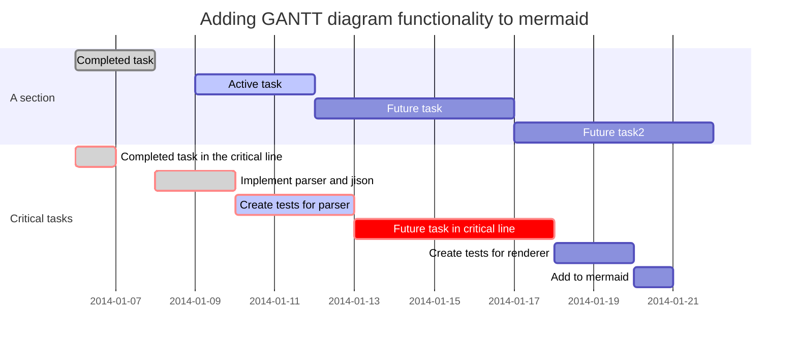

# SCRS: Student Course Registration System

A simple, desktop-based Course Registration System seeking to design and implement a management platform for students, instructors, and registrars to be able to create and enroll in courses.

## References
* [CRS Source Code][GHCRS]
* [Requirements Document][reqDoc]
* [GIt Best Practises][GHBestPractises]

[GHCRS]: https://github.com/Seraphendipity/CRS
[reqDoc]: https://onedrive.live.com/view.aspx?resid=CCE6DCAABC5C55E6!3295&ithint=file%2cxlsx&authkey=!AMBJkIp21NZyYXA
[GHBestPractises]: https://github.com/trein/dev-best-practices/wiki/Git-Commit-Best-Practices


## Data Structure

```mermaid
classDiagram
CRE <|-- User
    User <|-- Instructor
    User : size()
    User : - blazerid : string
    User <|-- Student
        Student <|-- Postgraduate
        Student <|-- Undergraduate
CRE <|-- aCourse
    aCourse <|-- iCourse
        iCourse o-- Location
        iCourse o-- Time
    aCourse : - crn
    aCourse : - description
CRE : - uid : int
CRE : - name : string

Semester o-- iCourse
Semester : - year : season
Semester : - season : string
Semester : + getTerm()
Semester : + getCourse(crn)
Semester : + getCourse(id)
```

### Instructors

#### Properties
* id
* bActive
* fName
* mName
* lName
* dateBirth
* blazerName
* imageId
* dateEmploy
* departmentId

#### Methods
* 

### Department

#### Properties
* id
* bActive
* code

#### Methods
* 

### Student

#### Properties
* id
* bActive
* fName
* mName
* lName
* dateBirth
* blazerName
* imageId
* dateEnroll
* declaredMajorsIds
* declaredMinorsIds

#### Methods
* getName():  Returns full name as string.
* getNames(): Returns full name as array.
* getNameCommon(): Returns first and last names as a string.
* getNameInversed(): Returns the full name as string, last name first, then comma, then first name then middle inital, as a string.

### aCourse

#### Properties
* id
* bActive <!-- Only if course is removed from listing; time-independent, action-dependent -->
* departmentId
* code
* title
* description

#### Methods
* getAbbreviation(): string `department+code`, e.g. EE433 
* 


### iCourse

#### Properties
* id <!--effectively CRN -->
* bActive <!-- Effectively time-dependent, usually action-independent -->
* aCourseId
* semesterId
* sectionId
* instructorId

#### Methods
* getLevel(): the first 1-2 digits of crn, indicating level of the course.
* getSemYear(): calls semester to get `semester+year` as string, e.g. FA2019.
* 

### Registration

#### Properties
* id
* bActive <!-- Time (semester ending) and Action (dropping) Dependent -->
* iCourseId
* studentId
* dateRegister

#### Methods


### Semester

#### Properties
* id
* dateStart
* dateEnd
* initials

#### Methods
* getName(): Return name from `initials`, e.g. FA -> Fall

### Section
Defines blocks of time in a day.

#### Properties
* id
* code
* timeStart
* timeEnd

```mermaid
sequenceDiagram %% diagram
  %% participant
  participant S as Student
  participant C as Course
  participant C as Carol
  %% arrows
  B->C: Solid line without arrow
  B-->C: Dotted line without arrow
  B->>C:Solid line with arrowhead
  B-->>C: Dotted line with arrowhead
  B-xC: Solid line with a cross at end
  B--xC: Dotted line with a cross at end
  %% activations
  activate John
  deactivate John
  %% activation shorthand
  Bob->>+Carol: Hello Carol, how are you?
  B-->>-C: Great!
  %% notes
  Note left of Alice: Alice likes to chat
  Note over B,C: Bob whispers when sick
  %% loop
  loop Every minute
        B-->C: Can you hear me?
  end
  %% alt
  alt is sick
    B-->C: Not so good :(
  else is well
    B->C: Feeling fresh like a daisy
  end
  opt Extra response
    B->C: You, Carol?
  end
```




## SQL

Create Students
```sql
CREATE TABLE `scrs`.`students` ( `id` INT NOT NULL AUTO_INCREMENT , `bActive` BOOLEAN NULL DEFAULT TRUE , `firstName` VARCHAR(255) NULL DEFAULT NULL , `middleName` VARCHAR(255) NULL DEFAULT NULL , `lastName` VARCHAR(255) NULL DEFAULT NULL , `blazerName` VARCHAR(255) NULL DEFAULT NULL , `imageId` INT NULL DEFAULT NULL , `dateBirth` DATE NULL DEFAULT NULL , `dateEnroll` DATE NOT NULL DEFAULT CURRENT_TIMESTAMP , `declaredMajorsIds` VARCHAR(255) NOT NULL , `declaredMinorsIds` VARCHAR(255) NULL DEFAULT NULL , PRIMARY KEY (`id`)) ENGINE = InnoDB;
```

Create Instructors
```sql
CREATE TABLE `scrs`.`students` ( `id` INT NOT NULL AUTO_INCREMENT , `bActive` BOOLEAN NULL DEFAULT TRUE , `firstName` VARCHAR(255) NULL DEFAULT NULL , `middleName` VARCHAR(255) NULL DEFAULT NULL , `lastName` VARCHAR(255) NULL DEFAULT NULL , `blazerName` VARCHAR(255) NULL DEFAULT NULL , `imageId` INT NULL DEFAULT NULL , `dateBirth` DATE NULL DEFAULT NULL , `dateEmploy` DATE NOT NULL DEFAULT CURRENT_TIMESTAMP , `department` INT NULL DEFAULT NULL , PRIMARY KEY (`id`)) ENGINE = InnoDB;
```

Create aCourses
```sql
CREATE TABLE `scrs`.`acourses` ( `id` INT NOT NULL , `bActive` BOOLEAN NOT NULL DEFAULT TRUE , `departmentId` INT NULL DEFAULT NULL , `code` VARCHAR( 10) NULL DEFAULT NULL , `title` VARCHAR(255) NULL DEFAULT NULL , `description` VARCHAR(255) NULL DEFAULT NULL , PRIMARY KEY (`id`)) ENGINE = InnoDB;
```

Create iCourses
```sql
CREATE TABLE `scrs`.`icourses` ( `id` INT NOT NULL , `bActive` BOOLEAN NOT NULL DEFAULT FALSE , `aCourseId` INT NULL DEFAULT NULL , `semesterId` INT NULL DEFAULT NULL , `sectionId` INT NULL DEFAULT NULL , `instructorId` INT NULL DEFAULT NULL , PRIMARY KEY (`id`)) ENGINE = InnoDB;
```

Create Registrations
```sql
CREATE TABLE `scrs`.`registrations` ( `id` INT NOT NULL , `bActive` BOOLEAN NOT NULL DEFAULT TRUE , `iCourseId` INT NULL DEFAULT NULL , `studentId` INT NULL DEFAULT NULL , `dateRegister` DATE NULL DEFAULT NULL , PRIMARY KEY (`id`)) ENGINE = InnoDB;
```

Creat Semesters
```sql
CREATE TABLE `scrs`.`semesters` ( `id` INT NOT NULL , `dateStart` DATE NULL DEFAULT NULL , `dateEnd` DATE NULL DEFAULT NULL , `initials` INT NULL DEFAULT NULL , PRIMARY KEY (`id`)) ENGINE = InnoDB;

```

Creat Sections
```sql
CREATE TABLE `scrs`.`sections` ( `id` INT NOT NULL , `timeStart` TIME NULL DEFAULT NULL , `timeEnd` TIME NULL DEFAULT NULL , `days` VARCHAR(7) NULL DEFAULT NULL COMMENT 'e.g. SMTWRFS' , `code` VARCHAR(10) NULL DEFAULT NULL , PRIMARY KEY (`id`)) ENGINE = InnoDB;
```

Registration Constraints
```sql
ALTER TABLE `registrations` ADD CONSTRAINT `CO-Registration-iCourse` FOREIGN KEY (`iCourseId`) REFERENCES `icourses`(`id`) ON DELETE RESTRICT ON UPDATE NO ACTION; ALTER TABLE `registrations` ADD CONSTRAINT `CO-Registration-Student` FOREIGN KEY (`studentId`) REFERENCES `students`(`id`) ON DELETE RESTRICT ON UPDATE NO ACTION;
```

iCourse Constraints
```sql
ALTER TABLE `icourses` ADD CONSTRAINT `CO-iCourse-aCourse` FOREIGN KEY (`aCourseId`) REFERENCES `acourses`(`id`) ON DELETE RESTRICT ON UPDATE NO ACTION; ALTER TABLE `icourses` ADD CONSTRAINT `CO-iCourse-Semester` FOREIGN KEY (`semesterId`) REFERENCES `semesters`(`id`) ON DELETE RESTRICT ON UPDATE NO ACTION; ALTER TABLE `icourses` ADD CONSTRAINT `CO-iCourse-Section` FOREIGN KEY (`sectionId`) REFERENCES `sections`(`id`) ON DELETE RESTRICT ON UPDATE NO ACTION; ALTER TABLE `icourses` ADD CONSTRAINT `CO-iCourse-Instructor` FOREIGN KEY (`instructorId`) REFERENCES `instructors`(`id`) ON DELETE RESTRICT ON UPDATE NO ACTION;
```

iCourse Constraints
```sql

```

iCourse Constraints
```sql

```
